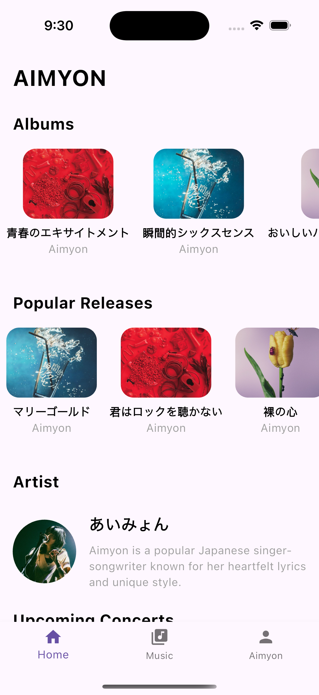
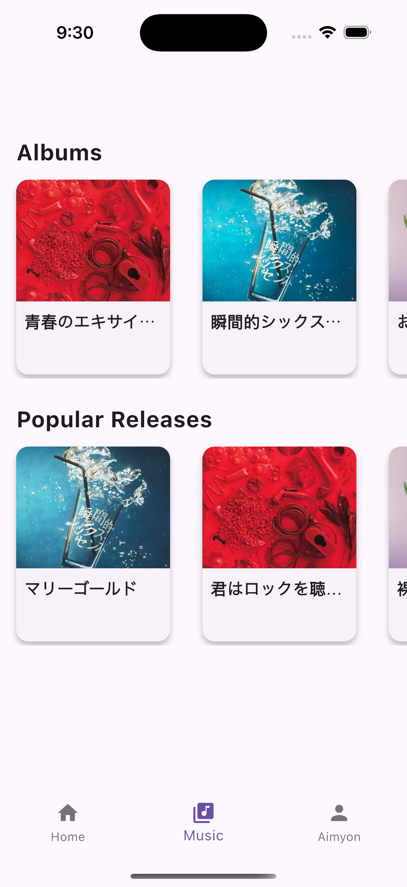
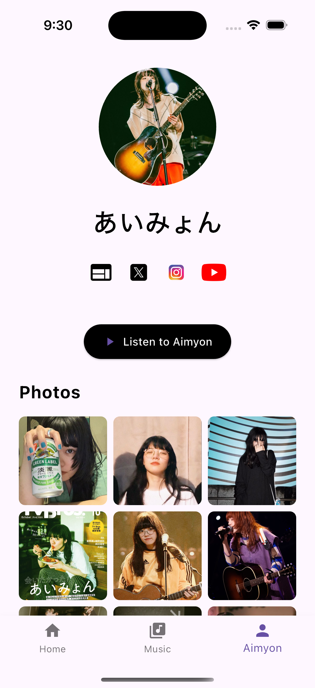

# Aimyon Flutter Project

This project is a Flutter-based application created as a college assignment. It demonstrates the use of multiple Flutter widgets and advanced features such as custom widget constructors, animations, and multi-file project architecture. The app can run on **iOS, Android, Web, or Windows**.

## 🚀 Overview

The project features:
- **📜 Scrollable Content:** Using `SingleChildScrollView` for vertical scrolling.
- **🛠 Custom Widgets:** Multiple stateless and stateful widgets like `HeaderWidget`, `SectionTitle`, `AlbumWidget`, etc.
- **✅ Required Widgets:**  
  - `Text`, `Image`, `Icon`, `Column`, `Row`, `Color`, `Stack`, `SingleChildScrollView`.
- **✨ Additional Widgets:**  
  - `Container`, `Padding`, `SizedBox`, `ClipRRect`, `SafeArea`, `Transform`, `Divider`, and more.
- **🎞️ Animations:**  
  - Fade and slide animations for smooth transitions.  
  - A continuously rotating **music disc**.
- **🎯 Advanced Features:**  
  - Custom data types (`Music`, `Concert`).  
  - Collection-for loops in `ListView` builders.  
  - Navigation with `Hero` animations.
- **📦 External Packages:**  
  - `url_launcher` for launching URLs.  
  - `google_maps_flutter` for potential map integration.  
  - `flutter_launcher_icons` for custom app icon generation.
  
## Screenshots

<p align="center">
  
  
  
</p>

## 📁 Project Structure

```plaintext
aimyon_project/
├── android/
├── ios/
├── lib/
│   ├── models/
│   │   ├── music.dart
│   │   ├── song.dart
│   │   ├── concert.dart
│   │   └── music_data.dart
│   ├── widgets/
│   │   ├── album_widget.dart
│   │   ├── album_details_view.dart
│   │   ├── artist_widget.dart
│   │   ├── concert_widget.dart
│   │   ├── music_disc_widget.dart
│   │   ├── home_content.dart
│   │   ├── music_view.dart
│   │   └── aimyon_intro_page.dart
│   └── main.dart
├── pubspec.yaml
└── README.md
```

## Getting Started

### Prerequisites

- [Flutter SDK](https://flutter.dev/docs/get-started/install)
- A code editor like [Visual Studio Code](https://code.visualstudio.com/) or [Android Studio](https://developer.android.com/studio)

### Installation

1. **Clone the Repository**

   ```bash
   git clone <repository_url>
   cd aimyon_project
   ```

2. **Install Dependencies**

   ```bash
   flutter pub get
   ```

3. **Run the App**

Run the following command to start the app on an emulator or connected device:

```bash
flutter run
```
## 🎨 Customization

### 📂 Assets  
Update the images and icons in the `assets/` folder. Make sure to declare them in `pubspec.yaml`.

### 📜 Data  
Modify the sample data in `MusicData` to change album, release, and concert details.

### 🎭 UI & Animations  
Customize widget styles, animations, and transitions as needed.

### 📱 App Icon  
Use the `flutter_launcher_icons` package to change the app icon.  
Update the `flutter_icons` section in `pubspec.yaml` and run:

```bash
flutter pub run flutter_launcher_icons:main
